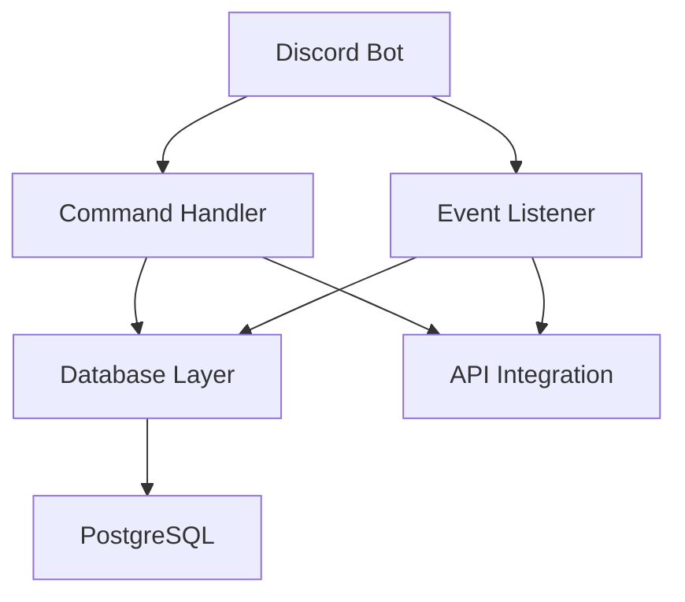

# New Features in Kroosybul AI 🚀

This document describes all the enhanced features that have been added to Kroosybul AI, making it a more powerful and intelligent code generation platform.

## Table of Contents

1. [Expanded Project Templates](#expanded-project-templates)
2. [Multimodal Prompt Understanding](#multimodal-prompt-understanding)
3. [AI Architecture Planner](#ai-architecture-planner)
4. [Natural-Language Debugging](#natural-language-debugging)
5. [Dependency Intelligence](#dependency-intelligence)
6. [AI-Powered Test Summaries](#ai-powered-test-summaries)
7. [Multi-Model Support](#multi-model-support)
8. [AI Comment & Docstring Generator](#ai-comment--docstring-generator)
9. [Performance Metrics](#performance-metrics)
10. [Reusable Component Library](#reusable-component-library)
11. [Enhanced API Endpoints](#enhanced-api-endpoints)

---

## Expanded Project Templates

### Overview
Kroosybul AI now includes **10+ new project templates** covering modern development needs.

### New Templates Added

#### 🤖 Discord Bot
- **Languages**: Python, JavaScript, TypeScript
- **Features**: Command handling, slash commands, event listeners, database integration
- **Frameworks**: discord.py, discord.js

#### 📊 Flask Dashboard
- **Language**: Python
- **Features**: User authentication, real-time data, RESTful APIs, admin panel, charts
- **Frameworks**: Flask, Flask-SocketIO, Flask-SQLAlchemy, Flask-Login

#### ⚡ Next.js Dashboard
- **Languages**: TypeScript, JavaScript
- **Features**: SSR, API routes, authentication, responsive design, dark mode
- **Frameworks**: Next.js, React, TailwindCSS, SWR

#### 🧠 AI Agent (LangChain)
- **Language**: Python
- **Features**: LLM integration, vector stores, tool calling, document processing
- **Frameworks**: LangChain, OpenAI, ChromaDB

#### 🤝 AI Agent (CrewAI)
- **Language**: Python
- **Features**: Multi-agent systems, agent collaboration, task delegation
- **Frameworks**: CrewAI, LangChain, OpenAI

#### 🎮 WebGL Mini-Game
- **Languages**: JavaScript, TypeScript
- **Features**: 3D rendering, physics simulation, animation, asset loading
- **Frameworks**: Three.js, Cannon.js, GSAP

#### 💬 Telegram Bot
- **Languages**: Python, JavaScript, TypeScript
- **Features**: Command handlers, inline keyboards, media handling, webhooks
- **Frameworks**: python-telegram-bot, node-telegram-bot-api, Telegraf

#### ⚡ FastAPI Microservice
- **Language**: Python
- **Features**: Async endpoints, auto-generated docs, caching, JWT auth
- **Frameworks**: FastAPI, Uvicorn, SQLAlchemy, Redis

#### 🔌 Chrome Extension
- **Languages**: JavaScript, TypeScript
- **Features**: Popup UI, content scripts, background workers, storage API
- **Frameworks**: Chrome Extensions API

#### 🖥️ Electron Desktop App
- **Languages**: JavaScript, TypeScript
- **Features**: Cross-platform, IPC communication, native menus, auto-updates
- **Frameworks**: Electron

### Usage

```bash
# Via API
GET /api/templates

# Filter by category
GET /api/templates/category/bot
GET /api/templates/category/ai
GET /api/templates/category/web
```

---

## Multimodal Prompt Understanding

### Overview
Upload existing code files to provide context for AI-powered project generation.

### Features
- **File Upload Support**: Upload `.py`, `.js`, `.ts`, `.java`, and other code files
- **Context-Aware Generation**: AI analyzes uploaded files and extends/refactors them
- **Multiple Files**: Upload multiple files for comprehensive context

### Usage

```javascript
// Client-side (WebSocket)
socket.emit('upload_file', {
    filename: 'existing_app.py',
    content: fileContent
});

// Listen for confirmation
socket.on('file_uploaded', (data) => {
    console.log('File uploaded:', data.filename);
});
```

### Use Cases
- **Extend Existing Projects**: Upload your current codebase and ask for new features
- **Refactor Code**: Upload code that needs improvement
- **Learn from Examples**: Upload reference code for AI to follow patterns

---

## AI Architecture Planner

### Overview
Before generating code, Kroosybul AI creates a visual architecture diagram using Mermaid.js.

### Features
- **Automatic Diagram Generation**: Creates flowcharts showing project structure
- **Component Relationships**: Shows how modules interact
- **Data Flow Visualization**: Illustrates data movement through the system
- **Technology Stack**: Highlights frameworks and dependencies

### Example Output



### Usage
The architecture diagram is automatically generated during project planning and emitted via WebSocket:

```javascript
socket.on('architecture_diagram', (data) => {
    // data.diagram contains Mermaid.js code
    // data.format = 'mermaid'
    renderMermaid(data.diagram);
});
```

---

## Natural-Language Debugging

### Overview
When code fails tests, the AI explains errors in plain English with actionable fix suggestions.

### Features
- **Human-Friendly Explanations**: Converts technical errors to understandable language
- **Root Cause Analysis**: Explains why the error occurred
- **Step-by-Step Fixes**: Provides clear instructions to resolve issues
- **Prevention Tips**: Suggests how to avoid similar errors

### Example

**Error Message:**
```
SyntaxError: invalid syntax at line 42
```

**AI Explanation:**
```
🔍 Error Explanation:
This is a Python syntax error, which means the code structure is incorrect.

Why it occurred:
You're likely missing a colon (:) at the end of a function or conditional statement,
or you have mismatched parentheses/brackets.

How to fix:
1. Check line 42 for missing colons after function definitions or if/for/while statements
2. Verify all opening brackets have corresponding closing brackets
3. Ensure proper indentation

Prevention:
Use a linter like flake8 or pylint to catch syntax errors before running code.
```

### Usage
Error explanations are automatically sent during the refinement loop:

```javascript
socket.on('error_explanation', (data) => {
    console.log('Error:', data.error);
    console.log('Explanation:', data.explanation);
});
```

---

## Dependency Intelligence

### Overview
Automatically detects and manages project dependencies by analyzing imports.

### Features
- **Smart Import Detection**: Parses code to find all required packages
- **Multi-Language Support**: Works with Python, JavaScript, TypeScript, and more
- **Auto-Update Config Files**: Automatically updates `requirements.txt`, `package.json`, etc.
- **Version Management**: Suggests appropriate version constraints

### Supported Languages
- **Python**: Detects `import` and `from ... import` statements
- **JavaScript/TypeScript**: Detects `require()`, `import from`, and `import` statements
- **Go**: Parses `import` blocks
- **Rust**: Analyzes `use` statements

### How It Works

```python
# AI analyzes this code:
import flask
from sqlalchemy import create_engine
import requests

# Automatically generates requirements.txt:
flask==3.0.0
sqlalchemy==2.0.23
requests==2.31.0
```

---

## AI-Powered Test Summaries

### Overview
After running tests, the AI generates a comprehensive, human-readable summary.

### Features
- **Overall Status**: Clear pass/fail indication
- **Key Issues**: Bullet-point list of main problems
- **Recommended Actions**: Prioritized next steps
- **Coverage Analysis**: Summary of what was tested

### Example Summary

```markdown
✅ Overall Status: Tests passed with minor warnings

🔍 Key Issues Found:
- 2 deprecation warnings in authentication module
- 1 unused import in utils.py
- Test coverage at 87% (target: 90%)

📋 Recommended Next Steps:
1. Update deprecated functions in auth.py to use new API
2. Remove unused imports to clean up code
3. Add tests for edge cases in payment processing module

All critical functionality is working correctly. The warnings are non-blocking.
```

### Usage

```javascript
socket.on('test_summary', (data) => {
    displaySummary(data.summary);
});
```

---

## Multi-Model Support

### Overview
Choose from multiple AI models for project generation.

### Supported Models

#### 🤖 Anthropic Claude
- **Model**: Claude Sonnet 4.5
- **Strengths**: Code generation, reasoning, long context
- **Max Tokens**: 8,000

#### 🌟 OpenAI GPT
- **Models**: GPT-4, GPT-4 Turbo
- **Strengths**: Versatile, creative, well-tested
- **Max Tokens**: 8,000 (GPT-4), 4,000 (Turbo)

#### 🔮 Google Gemini
- **Model**: Gemini Pro
- **Strengths**: Fast, multimodal, efficient
- **Max Tokens**: 8,000

### Configuration

Add API keys to `.env`:

```bash
# Choose one or more
ANTHROPIC_API_KEY=your_key_here
OPENAI_API_KEY=your_key_here
GOOGLE_API_KEY=your_key_here
```

### Usage

```bash
# Get available models
GET /api/models

# Response:
{
  "models": [
    {
      "provider": "anthropic",
      "name": "Claude Sonnet 4.5",
      "model_id": "claude-sonnet-4-5-20250929"
    },
    {
      "provider": "openai",
      "name": "GPT-4",
      "model_id": "gpt-4"
    }
  ]
}
```

---

## AI Comment & Docstring Generator

### Overview
Automatically generate comprehensive documentation for any code.

### Features
- **Module-Level Docs**: High-level file descriptions
- **Function Docstrings**: Parameter types, return values, examples
- **Inline Comments**: Explanations for complex logic
- **Type Hints**: Adds type annotations (Python, TypeScript)
- **Best Practices**: Follows language-specific documentation standards

### Example

**Before:**
```python
def process_payment(amount, user_id, method):
    if method == 'card':
        result = stripe.charge(amount, user_id)
        return result
    elif method == 'paypal':
        result = paypal.charge(amount, user_id)
        return result
```

**After:**
```python
def process_payment(amount: float, user_id: str, method: str) -> dict:
    """
    Process a payment transaction for a user.

    Args:
        amount (float): The payment amount in USD
        user_id (str): Unique identifier for the user
        method (str): Payment method ('card' or 'paypal')

    Returns:
        dict: Transaction result containing status and transaction_id

    Raises:
        ValueError: If method is not supported
        PaymentError: If payment processing fails

    Example:
        >>> process_payment(99.99, 'user_123', 'card')
        {'status': 'success', 'transaction_id': 'txn_abc123'}
    """
    # Process credit card payments via Stripe
    if method == 'card':
        result = stripe.charge(amount, user_id)
        return result
    # Process PayPal payments
    elif method == 'paypal':
        result = paypal.charge(amount, user_id)
        return result
```

### Usage

```bash
POST /api/document/generate
Content-Type: application/json

{
  "code": "def my_function(): ...",
  "language": "python"
}
```

---

## Performance Metrics

### Overview
AI-powered algorithmic complexity analysis for your code.

### Features
- **Time Complexity**: Big-O notation estimation
- **Space Complexity**: Memory usage analysis
- **Performance Rating**: excellent/good/fair/poor
- **Bottleneck Detection**: Identifies slow operations
- **Optimization Suggestions**: Actionable improvements

### Example Analysis

```json
{
  "time_complexity": "O(n log n)",
  "space_complexity": "O(n)",
  "performance_rating": "good",
  "bottlenecks": [
    "Nested loops in data processing function",
    "Database query inside loop at line 45"
  ],
  "optimizations": [
    "Use batch database queries instead of individual calls",
    "Consider caching frequently accessed data",
    "Replace nested loop with hash map for O(n) time"
  ],
  "estimated_runtime": "For 10,000 items: ~500ms"
}
```

### Usage

```bash
POST /api/analyze/complexity
Content-Type: application/json

{
  "code": "your code here",
  "language": "python"
}
```

---

## Reusable Component Library

### Overview
Save and retrieve commonly used code components across projects.

### Features
- **Component Storage**: Save functions, classes, and modules
- **Search by Language**: Filter by programming language
- **Tag System**: Organize with custom tags
- **Full-Text Search**: Find components by name or description
- **Version History**: Track component updates

### Usage

#### Save a Component

```bash
POST /api/components/save
Content-Type: application/json

{
  "name": "JWT Authentication",
  "code": "def authenticate_jwt(token): ...",
  "language": "python",
  "description": "Validates JWT tokens and returns user data",
  "tags": ["authentication", "security", "jwt"]
}
```

#### Search Components

```bash
POST /api/components/search
Content-Type: application/json

{
  "query": "authentication",
  "language": "python",
  "tags": ["security"]
}
```

#### Response

```json
{
  "components": [
    {
      "name": "JWT Authentication",
      "code": "def authenticate_jwt(token): ...",
      "language": "python",
      "description": "Validates JWT tokens and returns user data",
      "tags": ["authentication", "security", "jwt"],
      "created_at": "2025-11-05T10:30:00Z"
    }
  ]
}
```

---

## Enhanced API Endpoints

### Summary of New Endpoints

| Endpoint | Method | Description |
|----------|--------|-------------|
| `/api/templates/category/<category>` | GET | Get templates by category |
| `/api/models` | GET | List available AI models |
| `/api/components/search` | POST | Search reusable components |
| `/api/components/save` | POST | Save a component |
| `/api/analyze/complexity` | POST | Analyze code complexity |
| `/api/document/generate` | POST | Generate documentation |

### WebSocket Events

| Event | Direction | Description |
|-------|-----------|-------------|
| `upload_file` | Client → Server | Upload file for context |
| `file_uploaded` | Server → Client | File upload confirmation |
| `architecture_diagram` | Server → Client | Architecture diagram data |
| `error_explanation` | Server → Client | Natural language error explanation |
| `test_summary` | Server → Client | AI-generated test summary |

---

## Configuration

### Environment Variables

Add these to your `.env` file:

```bash
# Multi-Model Support
OPENAI_API_KEY=your_openai_key_optional
GOOGLE_API_KEY=your_google_key_optional

# Feature Flags (all enabled by default)
ENABLE_ARCHITECTURE_DIAGRAMS=true
ENABLE_ERROR_EXPLANATIONS=true
ENABLE_TEST_SUMMARIES=true
ENABLE_COMPONENT_LIBRARY=true
ENABLE_COMPLEXITY_ANALYSIS=true
```

---

## Examples

### Complete Workflow with New Features

```javascript
// 1. Upload existing code for context
socket.emit('upload_file', {
    filename: 'existing_api.py',
    content: existingCode
});

// 2. Request new feature
socket.emit('message', {
    message: 'Add user authentication to this API'
});

// 3. Receive architecture diagram
socket.on('architecture_diagram', (data) => {
    renderMermaid(data.diagram);
});

// 4. Get error explanations during refinement
socket.on('error_explanation', (data) => {
    showErrorHelp(data.explanation);
});

// 5. Receive test summary
socket.on('test_summary', (data) => {
    displaySummary(data.summary);
});

// 6. Project complete!
socket.on('project_complete', (data) => {
    downloadProject(data.download_url);
});
```

---

## Future Enhancements

These features are planned for future releases:

- 🎨 **Monaco Editor Integration**: In-browser code editing with syntax highlighting
- 🔒 **Dockerized Sandboxing**: Fully isolated code execution
- 👥 **Collaborative Sessions**: Real-time multi-user project generation
- 🎤 **Voice-to-Code**: Speech input via Whisper API
- 💬 **Codebase Chat**: Ask questions about generated code using embeddings
- 🚀 **Auto-Deployment**: One-click deploy to Render, Vercel, or Cloudflare

---

## Credits

These features were designed to make Kroosybul AI the most comprehensive AI-powered code generation platform available. Built with ❤️ for developers who want to build faster and smarter.

For questions or issues, please open an issue on GitHub.

---

**Last Updated**: November 2025
**Version**: 2.0.0
